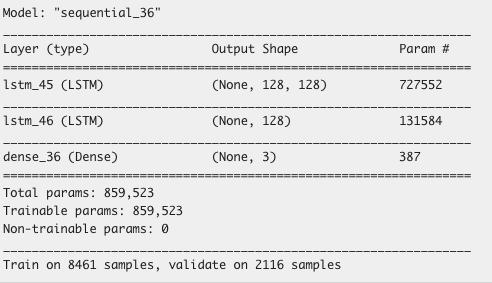
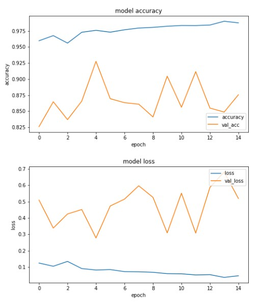

# 11/12 進捗報告

## やったこと

- GCP 移管
  ローカルだと特徴量抽出の段階でメモリ不足で止まってしまったため
  - アカウント作成
  - GCE(Google Compute Engine)の VM インスタンス作成
  - インスタンス上での jupyter 環境構築
  - インスタンス上で特徴量抽出、学習の実行
    
    

## 発生した問題

- GCE 上で学習を実行していると途中(20epochs)程度で予期せず学習が止まってしまう

  - EarlyStopping を指定しなくても止まってしまう
  - メモリ不足？

    - 学習中に free コマンドで調べても 30GB 弱フリーなメモリがあった
    - GCE からメモリを減らすような提案を受けた → メモリ不足ではなさそう

  - jupyter 側の限界？

- val_loss があまり低下しない
  - 学習率を下げてもあまり効果なし
  - データセットの問題か？
    - 作曲家ごとのデータ数に偏りがある

## やるべきこと

- [ ] データ数を揃える

## メモ

- epoch が止まる問題について

  - jupyter を使わずにターミナルから実行してみる
    - jupyter 側のメモリリークがあるかもしれない
  - Garbage Collection とか

- val_loss が振動する問題について

  - モデルが悪いのかデータセットが悪いのか判断がつかないため、とりあえずクラシック同士でなくもっと簡単に区別がつくデータセット同士で学習させてみる

    - 有意な結果が得られるのならばデータセットが悪いし、得られなければモデルが悪い(音では難しい？)

  - あまりいいやり方ではないが損失関数を色々試してみて結果が一番いいものを使用する
